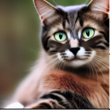
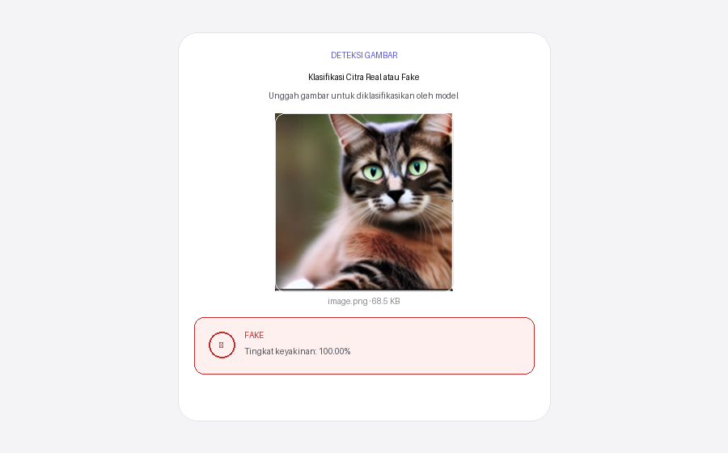

# Klasifikasi Citra Real atau Fake

Aplikasi web sederhana (Flask) untuk mengklasifikasikan apakah sebuah gambar **Real** (asli) atau **Fake** (buatan AI), menggunakan model CNN `model/my_model21.h5`.

## Menjalankan aplikasi

Aplikasi memerlukan Python 3.12 (TensorFlow tidak mendukung Python 3.14).

```powershell
py -3.12 -m venv .venv
.\.venv\Scripts\python.exe -m pip install -r requirements.txt
.\.venv\Scripts\python.exe app.py
```

Buka http://127.0.0.1:5000. Unggah gambar lalu tekan **Klasifikasi**.

Endpoint: `POST /predict` dengan field multipart `file` -> JSON `{label, probability, confidence}`.

## Menjalankan tes

```powershell
.\.venv\Scripts\python.exe smoke_test.py
```

Uji asap berbasis `unittest` (memuat TensorFlow, jadi butuh beberapa detik).

## Evaluasi pada dataset CIFAKE

```powershell
.\.venv\Scripts\python.exe eval_cifake.py
```

Perintah pertama mengunduh split test CIFAKE (~8 MB) dari Hugging Face ke `~/.cache/huggingface`. Referensi baseline: akurasi 93.95%, ROC-AUC 0.9861.

## Contoh Hasil Klasifikasi

Input `assets/image.png` (215×215 PNG, 68.5 KB) diuji via `POST /predict`:

```bash
curl -F file=@assets/image.png http://127.0.0.1:5000/predict
```

**Response:**
```json
{
  "label": "Fake",
  "probability": 2.1307e-06,
  "confidence": 0.999997
}
```

| Field | Nilai |
|-------|-------|
| Label | **FAKE** |
| Probability (sigmoid) | `2.13e-06` (< 0.5 → Fake) |
| Confidence | **100.00%** |
| Preprocessing | RGB → resize 32×32 LANCZOS → /255 |

### Input



### Screenshot Hasil di UI



> Badge merah `FAKE` dengan tingkat keyakinan 100.00% — model sangat yakin gambar adalah buatan AI.

## Struktur

- `app.py` — server Flask (unggah -> prediksi -> hasil)
- `config.py` — konstanta bersama (preprocessing, label kelas, path model)
- `eval_cifake.py` — skrip evaluasi pada CIFAKE test
- `smoke_test.py` — uji asap unit (unittest standar)
- `templates/index.html` — halaman UI (Bahasa Indonesia)
- `model/my_model21.h5` — model Keras, input 32x32x3 RGB, output sigmoid
- `assets/image.png` — contoh gambar uji
- `assets/screenshot-FAKE.png` — screenshot hasil klasifikasi di UI

## Pra-pemrosesan

Gambar diubah ke RGB, di-resize ke 32x32 (LANCZOS), lalu dibagi 255. Konstanta ini berada di `config.py`.
